# 📊 Social Media Data Integration & Analysis using AWS Glue  

This project demonstrates an **end-to-end ETL pipeline** built on **AWS Glue** to integrate, transform, and analyze **Twitter and Blog data** stored in Amazon S3.

---

## 🧩 Project Overview

**Objective:**  
To integrate and analyze social media data from Twitter and Blogs using AWS Glue Visual ETL, automate data transformation, and store the cleaned results in Amazon S3 for analysis.

**Data Sources:**
- `tweets_raw.csv`
- `blogs_raw.csv`

---

## ⚙️ Architecture Flow

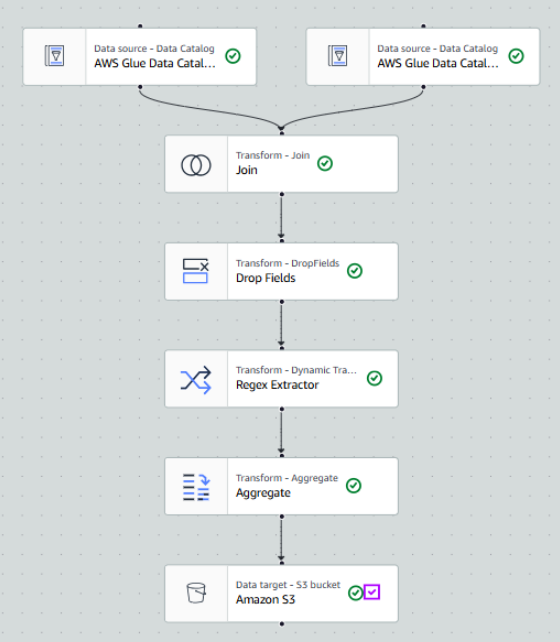

**Steps:**
1. Data extracted from S3 (two sources)
2. Joined on `user_id`
3. Dropped duplicate fields
4. Extracted hashtags with regex
5. Aggregated tweet counts & timestamps
6. Loaded final results to an S3 output bucket

---

## 🪣 Step 1 — S3 Bucket Setup

**Created input bucket:** `etl-twitter-blog-ashish`  
**Folders:** `blog-data` and `etl-social-media`

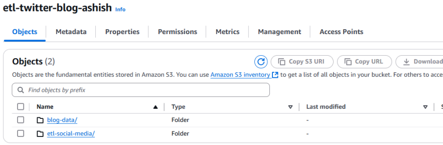
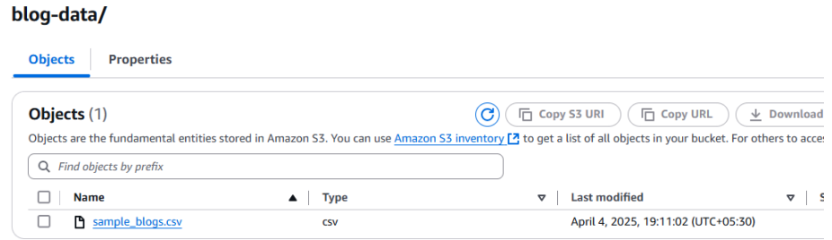


---

## 🧠 Step 2 — AWS Glue Classifiers

Created classifiers for reading both CSV files.

| Classifier | Type | Delimiter | Quote | Headers |
|-------------|------|------------|--------|----------|
| `twitter_data` | CSV | , | " | Has headings |
| `blog_data` | CSV | , | " | Has headings |

**Visuals:**

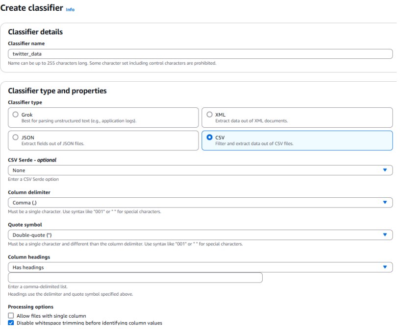
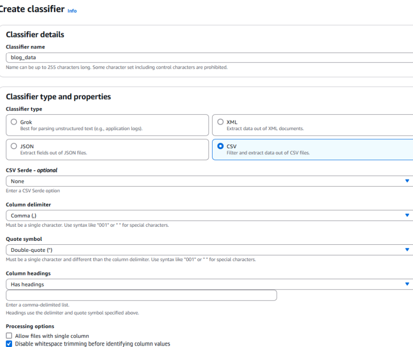

---

## 🧾 Step 3 — IAM Role Configuration

Created IAM role `glue-role` with **AdministratorAccess** to allow Glue to read/write to S3 and create jobs.

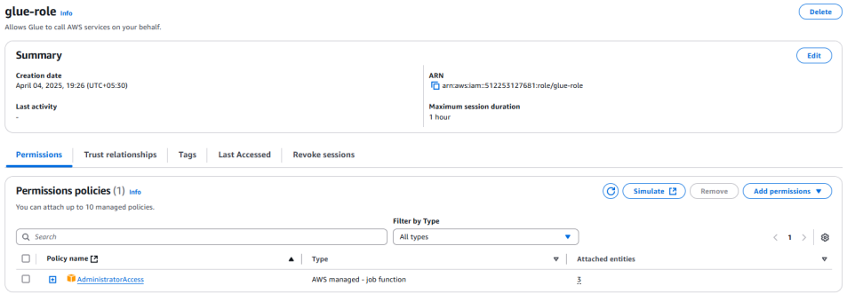

---

## 🕸️ Step 4 — AWS Glue Crawlers

Crawlers were created to catalog both datasets into the **AWS Glue Data Catalog**.

| Crawler | Source | Database | Status |
|----------|---------|-----------|---------|
| `tweet-crawl` | tweets_raw.csv | social_media_data | ✅ Success |
| `blog-crawler` | blogs_raw.csv | social_media_data | ✅ Success |

**Visuals:**
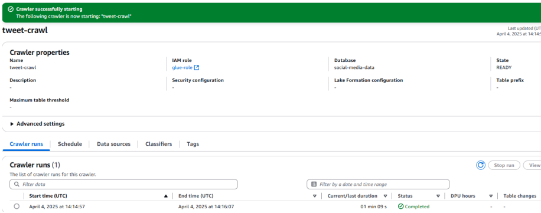
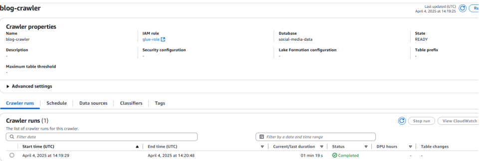

---

## 🧮 Step 5 — AWS Glue Visual ETL Job

This is the visual ETL pipeline created in Glue Studio:


**Transformations included:**
1. Join → Inner Join on `user_id`
2. Drop Fields → Removed duplicate `user_id`
3. Regex Extractor → Extracted hashtags using pattern `#(\w+)`
4. Aggregate → Counted tweets per user & calculated minimum timestamp
5. Target → Wrote result to S3 output bucket

---

## ✅ Step 6 — ETL Job Execution

Job executed successfully and saved the output to `etl-cep-output-ashish`.

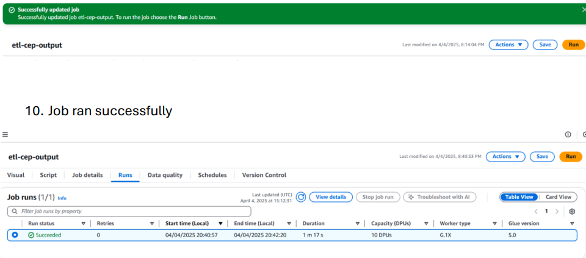

---

## 🗃️ Step 7 — Output Verification

The final dataset was saved in an S3 output folder.  
A sample SQL query was executed on the result file to verify correctness.

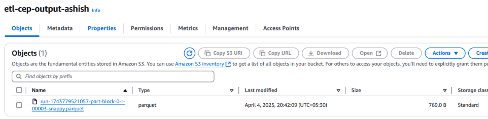
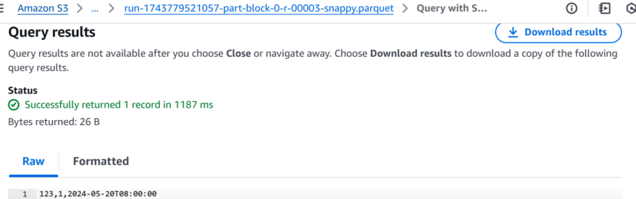

---

## 🧾 Result Snapshot

| User ID | Blog ID | Timestamp |
|----------|----------|------------|
| 123 | 1 | 2024-05-20T08:00:00 |

---

## 🧠 Key Learnings

- Building ETL pipelines using **AWS Glue Visual Interface**  
- Managing **data catalogs, crawlers, and classifiers**  
- Using **Regex extraction and Aggregation** transformations  
- Automating S3-based data pipelines securely with **IAM roles**

---

## 🧰 Tools & Services Used

- **Amazon S3** – Data storage and output buckets  
- **AWS Glue** – ETL job, Data Catalog, Classifiers, Crawlers  
- **IAM** – Role-based access management  
- **AWS Glue Studio** – Visual ETL workflow design  
- **SQL on S3** – Query validation

---

## 📚 Files in This Repository

| Folder | Description |
|--------|--------------|
| `data/raw/` | Raw Twitter & Blog datasets |
| `data/processed/` | Sample output CSV |
| `docs/images/` | ETL visuals & AWS screenshots |
| `docs/report/` | Project report & guidelines |
| `src/` | Placeholder for AWS Glue job scripts |

---

## 🧠 Ethical Statement

All data is sample/anonymized and used only for educational purposes.  
No real user data or sensitive information is stored in this repository.

---
### 📂 Repository Structure

```
aws-glue-social-media-etl/
│
├── README.md                
├── LICENSE                        
│
├── data/
│   ├── raw/
│   │   ├── tweets_raw.csv           ← Raw Twitter dataset
│   │   └── blogs_raw.csv            ← Raw Blog dataset
│   │
│   └── processed/
│       ├── etl_output_sample.csv    ← Local sample output (aggregated)
│       └── README_placeholder.txt   ← Note explaining real S3 output stored in AWS
│
├── docs/
│   ├── images/                      ← All AWS Glue screenshots & visuals
│   │   ├── s3-input-buckets.png
│   │   ├── s3-folder-blogs.png
│   │   ├── s3-folder-tweets.png
│   │   ├── twitter_data-glue-classifiers.png
│   │   ├── blog_data-glue-classifiers.png
│   │   ├── iam-role.png
│   │   ├── tweet-glue-crawlers-1.png
│   │   ├── blog-glue-crawlers-2.png
│   │   ├── etl-job-visual.png
│   │   ├── etl-job-run-success.png
│   │   ├── s3-output-bucket.png
│   │   └── sql-query-result.png
│   │
│   └── report/                      ← Course documentation & deliverables
│       ├── ETL_Project_Report.pdf   ←  final project report
│       └── Simplilearn_Project_Guidelines.pdf
│
└── src/
    └── README_placeholder.txt       ← Explains AWS Glue job stored inside AWS

```
## 🧑‍💻 Author

**Ashish Chamel**  
